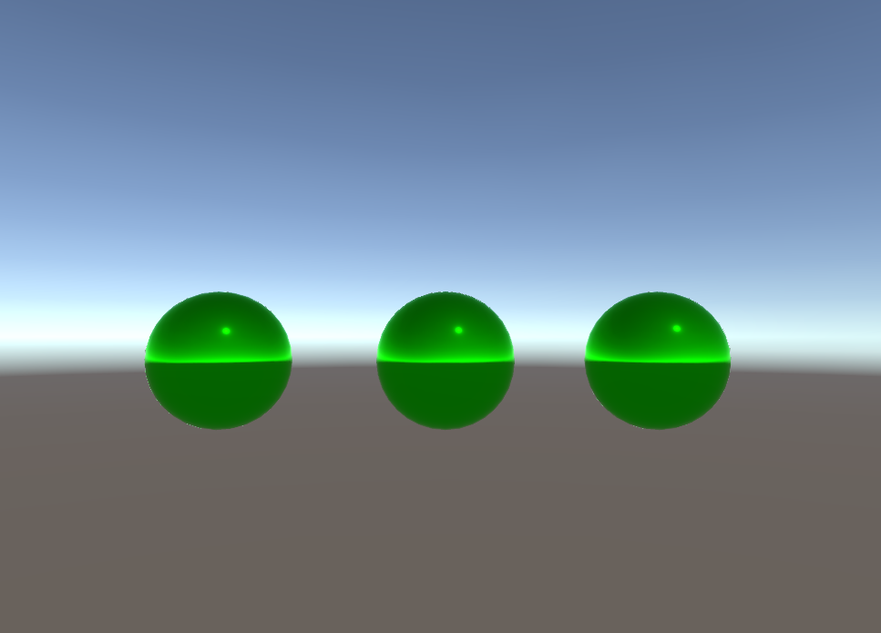
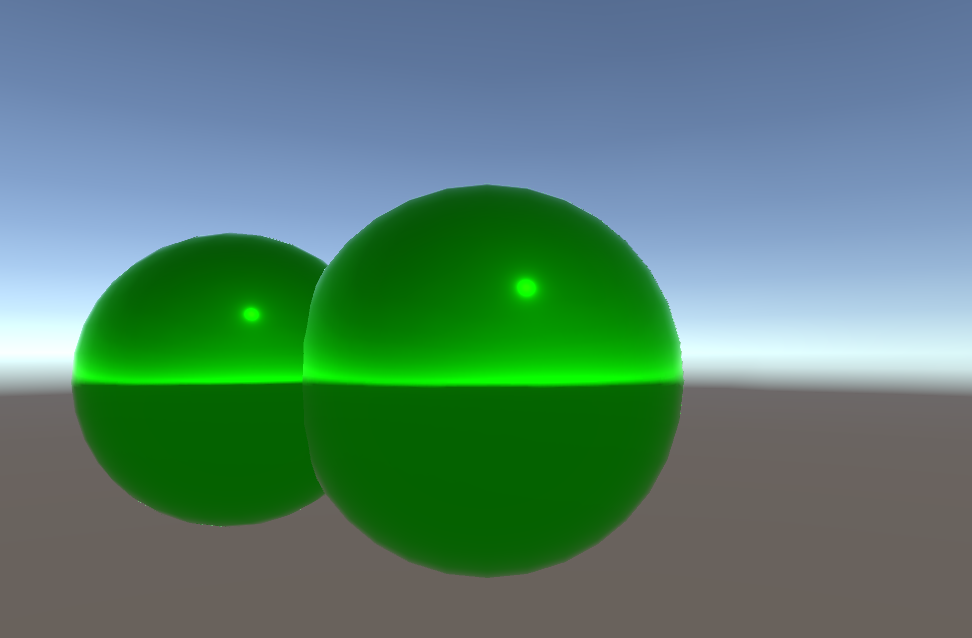

# Zenva Balloon Popper Game

A very simple balloon popper game made in Unity. This is essentially my very first Unity game. This taught me the basics of how Unity works and how to attach C# scripts to in game objects. Each time you click a balloon, it grows bigger. At 8 clicks, it pops.

# References
I made this during a course I took with Zenva
